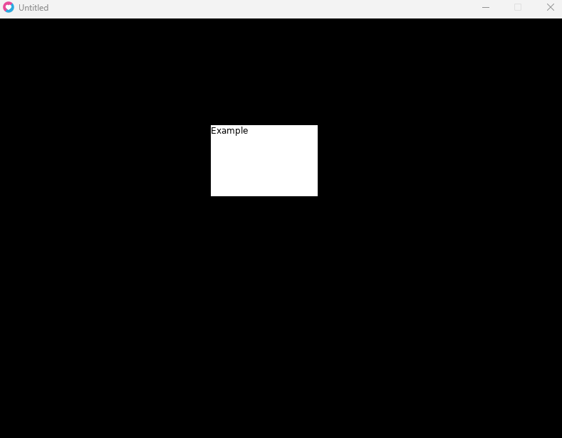

# LOVE2D-button
A simple librarie to create button with LÖVE 2D.

## Features:
* Exectue function on click

## How it's work:
First step, require the librarie :
```lua
require "button.lua"
```

Second step, adding `button:new()` to `love.load()`, `button:update(dt)` to `love.update(dt)` and `button:draw()` to `love.draw()`.

Third step, create your button in `love.load()` like this:
````lua
ExampleButton = {button:new(300, 150,150,100,{1,1,1}, {1,0,1}, "Example", {0,0,0}, function()print("Example")end)}
````

## Result:



## Before using the lib !
This project is not finished yet !
